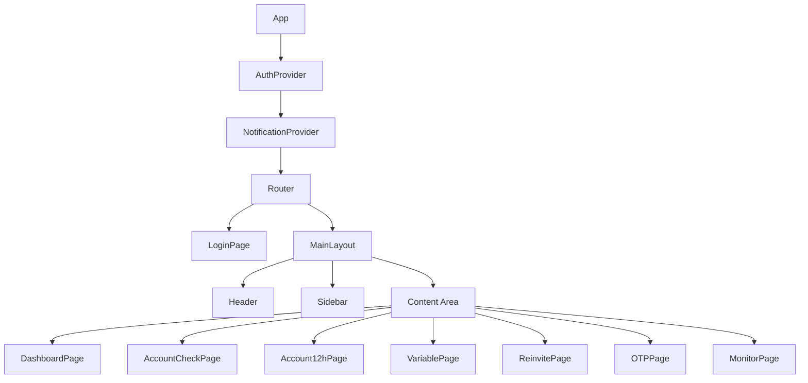

# Technical Design Document

## Overview

RITA Adobe is an internal web application that provides support staff with a unified interface for managing customer accounts through the ADES Support API. The application is built as a single-page application (SPA) using React with TypeScript, providing a responsive desktop-optimized interface for account management operations.

### Key Capabilities

- **Authentication Management**: Secure login/logout with token-based session management
- **Account Operations**: Status checking, 12-hour data retrieval, variable fetching, and reinvite functionality
- **OTP Retrieval**: Read and copy one-time passwords for customer assistance
- **Real-Time Monitoring**: WebSocket-based live updates for account activity
- **Unified Dashboard**: Consolidated view of all account information in one place

### Technology Stack

- **Frontend Framework**: React 18+ with TypeScript
- **State Management**: React Context API for global state (auth, notifications)
- **Routing**: React Router v6 for SPA navigation
- **HTTP Client**: Axios for REST API communication
- **WebSocket**: Native WebSocket API with reconnection handling
- **Styling**: CSS Modules or Tailwind CSS for component styling
- **Build Tool**: Vite for fast development and optimized production builds

## Architecture

The application follows a layered architecture pattern with clear separation of concerns:

```
┌─────────────────────────────────────────────────────────────────┐
│                        Presentation Layer                        │
│  ┌─────────────┐ ┌─────────────┐ ┌─────────────┐ ┌────────────┐ │
│  │   Layout    │ │    Pages    │ │ Components  │ │   Hooks    │ │
│  └─────────────┘ └─────────────┘ └─────────────┘ └────────────┘ │
├─────────────────────────────────────────────────────────────────┤
│                         State Layer                              │
│  ┌─────────────┐ ┌─────────────┐ ┌─────────────┐               │
│  │ AuthContext │ │NotifyContext│ │ Local State │               │
│  └─────────────┘ └─────────────┘ └─────────────┘               │
├─────────────────────────────────────────────────────────────────┤
│                        Service Layer                             │
│  ┌─────────────┐ ┌─────────────┐ ┌─────────────┐ ┌────────────┐ │
│  │ AuthService │ │AccountService│ │  OTPService │ │ WSService  │ │
│  └─────────────┘ └─────────────┘ └─────────────┘ └────────────┘ │
├─────────────────────────────────────────────────────────────────┤
│                       Infrastructure Layer                       │
│  ┌─────────────┐ ┌─────────────┐ ┌─────────────┐               │
│  │ HTTP Client │ │  WS Client  │ │Session Store│               │
│  └─────────────┘ └─────────────┘ └─────────────┘               │
└─────────────────────────────────────────────────────────────────┘
```

### Component Hierarchy



## Components and Interfaces

### Core Services

#### AuthService

Handles authentication operations with the ADES Support API.

```typescript
interface AuthService {
  login(username: string, password: string): Promise<AuthResult>;
  logout(): void;
  getToken(): string | null;
  isAuthenticated(): boolean;
  isTokenExpired(): boolean;
}

interface AuthResult {
  success: boolean;
  token?: string;
  error?: string;
}
```

#### AccountService

Manages account-related API operations.

```typescript
interface AccountService {
  checkAccount(email: string): Promise<AccountCheckResult>;
  getAccount12h(email: string): Promise<Account12hResult>;
  getVariables(email: string): Promise<VariableResult>;
  reinvite(email: string): Promise<ReinviteResult>;
}

interface AccountCheckResult {
  success: boolean;
  data?: Record<string, unknown>;
  error?: string;
}

interface Account12hResult {
  success: boolean;
  data?: Account12hRecord[];
  error?: string;
}

interface Account12hRecord {
  [key: string]: unknown;
}

interface VariableResult {
  success: boolean;
  data?: Record<string, unknown>;
  error?: string;
}

interface ReinviteResult {
  success: boolean;
  message?: string;
  error?: string;
}
```

#### OTPService

Handles OTP retrieval operations.

```typescript
interface OTPService {
  readOTP(email: string): Promise<OTPResult>;
}

interface OTPResult {
  success: boolean;
  otp?: string;
  error?: string;
}
```

#### WebSocketService

Manages real-time WebSocket connections for monitoring.

```typescript
interface WebSocketService {
  connect(email: string): void;
  disconnect(): void;
  onMessage(callback: (message: WSMessage) => void): void;
  onStatusChange(callback: (status: ConnectionStatus) => void): void;
  getStatus(): ConnectionStatus;
}

interface WSMessage {
  timestamp: string; // ISO 8601 format
  content: unknown;
}

type ConnectionStatus = 'disconnected' | 'connecting' | 'connected' | 'error';
```

### UI Components

#### EmailInput

Reusable validated email input component.

```typescript
interface EmailInputProps {
  value: string;
  onChange: (value: string) => void;
  onValidationChange: (isValid: boolean) => void;
  disabled?: boolean;
  placeholder?: string;
}
```

#### ActionButton

Button component with loading state support.

```typescript
interface ActionButtonProps {
  label: string;
  onClick: () => void;
  loading?: boolean;
  disabled?: boolean;
  variant?: 'primary' | 'secondary' | 'danger';
}
```

#### ToastNotification

Notification component for user feedback.

```typescript
interface ToastNotificationProps {
  id: string;
  type: 'success' | 'error' | 'info';
  message: string;
  autoDismiss?: boolean;
  duration?: number; // milliseconds
  onDismiss: (id: string) => void;
}
```

#### ConfirmDialog

Modal dialog for action confirmation.

```typescript
interface ConfirmDialogProps {
  isOpen: boolean;
  title: string;
  message: string;
  confirmLabel?: string;
  cancelLabel?: string;
  onConfirm: () => void;
  onCancel: () => void;
}
```

#### MonitorPanel

Real-time message display panel.

```typescript
interface MonitorPanelProps {
  messages: WSMessage[];
  maxMessages: number;
  status: ConnectionStatus;
}
```

#### ResultPanel

Generic panel for displaying operation results.

```typescript
interface ResultPanelProps {
  title: string;
  loading?: boolean;
  error?: string;
  children: React.ReactNode;
}
```

### Context Providers

#### AuthContext

```typescript
interface AuthContextValue {
  isAuthenticated: boolean;
  token: string | null;
  login: (username: string, password: string) => Promise<boolean>;
  logout: () => void;
  lastActivity: Date;
  updateActivity: () => void;
}
```

#### NotificationContext

```typescript
interface NotificationContextValue {
  notifications: Notification[];
  showSuccess: (message: string) => void;
  showError: (message: string) => void;
  showInfo: (message: string) => void;
  dismiss: (id: string) => void;
}

interface Notification {
  id: string;
  type: 'success' | 'error' | 'info';
  message: string;
  timestamp: Date;
}
```

## Data Models

### Authentication

```typescript
interface LoginCredentials {
  username: string;
  password: string;
}

interface AuthToken {
  token: string;
  expiresAt: number; // Unix timestamp
}

interface SessionData {
  token: string;
  expiresAt: number;
  lastActivity: number;
}
```

### Account Data

```typescript
interface AccountStatus {
  email: string;
  status: string;
  [key: string]: unknown; // Dynamic fields from API
}

interface Account12hData {
  records: Account12hRecord[];
  retrievedAt: string;
}

interface VariableData {
  email: string;
  variables: Record<string, unknown>;
}
```

### WebSocket

```typescript
interface WebSocketMessage {
  id: string;
  timestamp: string; // ISO 8601
  rawContent: string;
  parsedContent?: unknown;
}

interface MonitorState {
  email: string;
  status: ConnectionStatus;
  messages: WebSocketMessage[];
  connectedAt?: string;
  disconnectedAt?: string;
}
```

### Validation

```typescript
interface ValidationResult {
  isValid: boolean;
  error?: string;
}

interface EmailValidationRules {
  maxLength: 254;
  pattern: RegExp;
  required: boolean;
}
```

## Correctness Properties

*A property is a characteristic or behavior that should hold true across all valid executions of a system—essentially, a formal statement about what the system should do. Properties serve as the bridge between human-readable specifications and machine-verifiable correctness guarantees.*

The properties below were derived from the acceptance criteria prework analysis. Criteria that describe UI structure/styling (presence of fields, font size, layout), one-shot timing behaviors with a single fixed duration (3s auto-dismiss, 500ms debounce, 10s connect timeout, 30s request timeout, 30 min idle logout), and endpoint wiring are intentionally **not** expressed as properties — they are covered by example, integration, and visual tests in the Testing Strategy. Property-based testing is reserved for logic whose behavior varies meaningfully across a large input space.

### Property 1: Email Validation Correctness

*For any* string input, the email validation function SHALL accept it if and only if it matches the specified grammar — a local-part of alphanumeric characters, dots, hyphens, underscores, and plus signs, followed by exactly one `@` symbol, followed by a domain of alphanumeric characters, dots, and hyphens with at least one dot separating domain labels — AND its total length does not exceed 254 characters AND it is not empty or whitespace-only. Validation SHALL be deterministic: repeated calls with the same input return the same result.

**Validates: Requirements 8.1, 8.3, 8.5, 8.6**

### Property 2: Session Token Storage Round-Trip

*For any* authentication token string, storing the token via the session storage adapter and then retrieving it SHALL return the exact same token value, preserving all characters including special characters and whitespace.

**Validates: Requirements 1.3**

### Property 3: Bounded WebSocket Message Queue Invariant

*For any* sequence of N WebSocket messages appended to the monitoring queue, the resulting queue length SHALL equal min(N, 500), the queue SHALL retain exactly the most recent 500 messages (evicting the oldest first when the limit is exceeded), and the arrival order of retained messages SHALL be preserved.

**Validates: Requirements 7.1, 7.5**

### Property 4: WebSocket Message Timestamp Format

*For any* WebSocket message appended to the monitoring panel, the recorded timestamp SHALL match the ISO 8601 pattern `YYYY-MM-DDTHH:mm:ss` and SHALL represent the time the message was received by the client.

**Validates: Requirements 7.4**

### Property 5: API Response Data Display Completeness

*For any* successful API response containing key-value or record data (account status, 12-hour data, or variable data), the rendering function SHALL produce output that includes every key returned by the API and the stringified value for each key, omitting none. For tabular data, the column headers SHALL cover the union of all field keys across records and each row SHALL render each field.

**Validates: Requirements 2.3, 3.3, 4.3**

### Property 6: Action Button Enablement Invariant

*For any* combination of email input value and request state, an email-associated action button SHALL be enabled if and only if the email is valid (per Property 1) AND no API request for that action is currently in progress; otherwise it SHALL be disabled.

**Validates: Requirements 8.4, 10.1, 12.2**

### Property 7: Authentication Redirect Invariant

*For any* session state in which no authentication token exists in session storage or the stored token has expired (including the state produced by a 401 response clearing the token), the route-guard decision SHALL be "redirect to login" and access to the main interface SHALL be prevented.

**Validates: Requirements 1.6, 11.4, 11.5**

### Property 8: Authentication Token Header Inclusion

*For any* outbound API request configuration built while a valid token exists in session storage, the resulting request headers SHALL include that token in the Authorization header.

**Validates: Requirements 1.5**

### Property 9: Confirmation Dialog Email Consistency

*For any* valid email entered in the email input field, triggering the reinvite action SHALL open a confirmation dialog whose displayed text contains exactly that email address.

**Validates: Requirements 5.2**

### Property 10: Cancel Operation State Preservation

*For any* application state, opening the reinvite confirmation dialog and then cancelling it SHALL leave the application state (email input value, panel contents, and form states) identical to the state before the dialog was opened, and SHALL issue no reinvite request.

**Validates: Requirements 5.7**

### Property 11: Notification Stacking Order

*For any* sequence of notifications added to the notification stack, the rendered list SHALL order them most-recent-first, with the most recently added notification appearing at the top.

**Validates: Requirements 10.7**

### Property 12: Dashboard Email Persistence

*For any* email address entered in the dashboard input field and *any* sequence of operations performed within the same session, the email field value SHALL remain equal to the entered email until explicitly cleared by the user.

**Validates: Requirements 12.6**

### Property 13: Dashboard Panel Result Replacement

*For any* dashboard panel and *any* non-empty sequence of operation results routed to that panel, the panel content SHALL equal the most recent result only, with no remnants of previous results.

**Validates: Requirements 12.5**

## Error Handling

### API Error Handling Strategy

| Error Type | HTTP Status | User Feedback | Recovery Action |
|------------|-------------|---------------|-----------------|
| Authentication Failed | 401 | "Session expired. Please log in again." | Clear token, redirect to login |
| Invalid Request | 400 | Display API error message | Allow retry with corrected input |
| Not Found | 404 | "No data found for the specified account." | Display empty state |
| Server Error | 500 | "Server error. Please try again later." | Allow retry |
| Network Error | - | "Network error. Please check your connection." | Allow retry |
| Timeout | - | "Request timed out. Please try again." | Allow retry |

### WebSocket Error Handling

| Error Scenario | User Feedback | Recovery Action |
|----------------|---------------|-----------------|
| Connection Timeout (>10s) | "Connection timeout. Click to retry." | Show retry button |
| Connection Lost | "Connection lost. Attempting to reconnect..." | Auto-reconnect with backoff |
| Server Closed | "Server closed connection." | Update status indicator |
| Invalid Message | Log to console | Continue processing other messages |

### Validation Error Handling

| Validation Error | User Feedback | Timing |
|------------------|---------------|--------|
| Empty Email | "Email address is required" | On blur or submit |
| Invalid Format | "Please enter a valid email address" | Within 500ms of input change |
| Too Long (>254 chars) | "Email address exceeds maximum length" | On input |
| Empty Credentials | "Username/password is required" | On submit attempt |

### Session Error Handling

| Session Error | User Feedback | Recovery Action |
|---------------|---------------|-----------------|
| Token Expired | "Session expired. Please log in again." | Redirect to login |
| Storage Failure | Force page reload | Clear all state |
| Inactivity Timeout | "Session timed out due to inactivity." | Redirect to login |

## Testing Strategy

### Unit Testing

**Framework**: Jest with React Testing Library

**Coverage Areas**:
- Email validation logic (all valid/invalid patterns)
- Token storage and retrieval
- WebSocket message queue management
- Notification timing and dismissal
- Component rendering and state management

**Example Test Cases**:
- Login interface displays username and password fields (Req 1.1)
- Authentication error displays API error message (Req 1.4)
- Empty credentials show validation error (Req 1.7)
- Account check timeout after 30 seconds shows error (Req 2.6)
- Empty 12-hour data shows "no data available" message (Req 3.4)
- OTP displays with minimum 18px font size (Req 6.3)
- Clipboard copy failure shows error message (Req 6.8)
- WebSocket connection timeout shows retry button (Req 7.7)
- Logout completes within 1 second (Req 11.2)
- Inactivity timeout after 30 minutes (Req 11.6)

### Property-Based Testing

**Framework**: fast-check (integrated with Jest)

**Configuration**:
- Minimum 100 iterations per property test (`fc.assert(..., { numRuns: 100 })`)
- Each property implemented by a SINGLE property-based test
- Property-based testing libraries are used directly — properties are NOT implemented from scratch
- Each test tagged with a comment: **Feature: rita-adobe, Property {number}: {property_text}**

Only logic whose behavior varies meaningfully across a large input space is covered here. Timing behaviors with a single fixed duration, UI structure/styling, and endpoint wiring are covered by the Example, Integration, and Component test sections below.

**Property Tests**:

1. **Property 1: Email Validation Correctness**
   - Generators: valid emails per the grammar, malformed emails (missing/multiple `@`, no dot in domain, illegal characters), boundary lengths (254 vs 255 chars), empty/whitespace strings
   - Assert: validator accepts iff grammar + length + non-empty all hold; repeated calls are deterministic
   - Tag: `Feature: rita-adobe, Property 1: Email validation correctness`

2. **Property 2: Session Token Storage Round-Trip**
   - Generators: arbitrary token strings including special characters and whitespace
   - Assert: `read(store(token)) === token`
   - Tag: `Feature: rita-adobe, Property 2: Session token storage round-trip`

3. **Property 3: Bounded WebSocket Message Queue Invariant**
   - Generators: sequences of 0–1000 messages
   - Assert: final length = min(N, 500), retains most recent 500 in arrival order, oldest evicted first
   - Tag: `Feature: rita-adobe, Property 3: Bounded WebSocket message queue invariant`

4. **Property 4: WebSocket Message Timestamp Format**
   - Generators: arbitrary message payloads and receive times
   - Assert: appended timestamp matches `^\d{4}-\d{2}-\d{2}T\d{2}:\d{2}:\d{2}$` and equals the formatted receive time
   - Tag: `Feature: rita-adobe, Property 4: WebSocket message timestamp format`

5. **Property 5: API Response Data Display Completeness**
   - Generators: arbitrary key-value objects and arrays of record objects
   - Assert: every key and stringified value appears in the rendered key-value output; table headers cover the union of keys and every field renders
   - Tag: `Feature: rita-adobe, Property 5: API response data display completeness`

6. **Property 6: Action Button Enablement Invariant**
   - Generators: arbitrary email values (valid/invalid) paired with loading booleans
   - Assert: button enabled iff (email valid AND not loading)
   - Tag: `Feature: rita-adobe, Property 6: Action button enablement invariant`

7. **Property 7: Authentication Redirect Invariant**
   - Generators: arbitrary session states (valid unexpired token, expired token, missing token, post-401 cleared state)
   - Assert: guard decision is "redirect to login" iff no valid unexpired token
   - Tag: `Feature: rita-adobe, Property 7: Authentication redirect invariant`

8. **Property 8: Authentication Token Header Inclusion**
   - Generators: arbitrary request configs built while a token exists
   - Assert: resulting headers include the Authorization token
   - Tag: `Feature: rita-adobe, Property 8: Authentication token header inclusion`

9. **Property 9: Confirmation Dialog Email Consistency**
   - Generators: arbitrary valid emails
   - Assert: triggering reinvite opens a dialog whose text contains exactly that email
   - Tag: `Feature: rita-adobe, Property 9: Confirmation dialog email consistency`

10. **Property 10: Cancel Operation State Preservation**
    - Generators: arbitrary application states (email value, panel contents, form states)
    - Assert: open-then-cancel leaves state deep-equal to the pre-dialog state and issues no request
    - Tag: `Feature: rita-adobe, Property 10: Cancel operation state preservation`

11. **Property 11: Notification Stacking Order**
    - Generators: arbitrary sequences of notification additions
    - Assert: rendered order is most-recent-first
    - Tag: `Feature: rita-adobe, Property 11: Notification stacking order`

12. **Property 12: Dashboard Email Persistence**
    - Generators: arbitrary email + arbitrary sequence of operations
    - Assert: email field value remains the entered email throughout
    - Tag: `Feature: rita-adobe, Property 12: Dashboard email persistence`

13. **Property 13: Dashboard Panel Result Replacement**
    - Generators: arbitrary non-empty sequences of results routed to a panel
    - Assert: panel content equals the last result only
    - Tag: `Feature: rita-adobe, Property 13: Dashboard panel result replacement`

### Example, Edge-Case, and Integration Testing

The following acceptance criteria are best validated with concrete examples, edge cases, or mocked integration tests rather than property-based tests. Timing-driven behaviors use fake timers (`jest.useFakeTimers()`) for deterministic verification.

**Endpoint wiring (Integration — mock HTTP/WS client, 1–3 examples each)**:
- Auth token request to `/ades-support/auth/token` (Req 1.2)
- Account check request to `/ades-support/account/check` (Req 2.2)
- 12-hour data request to `/ades-support/account-12h` (Req 3.2)
- Variable data request to `https://var.ctv.ac/{email}` — external base URL, no Authorization header (Req 4.2)
- Reinvite request to `/ades-support/reinvite/{email}` on confirm (Req 5.4)
- OTP request to `/mail/read-otp-gpm?email={email}` (Req 6.2)
- WebSocket connection to the `wss://…/socket.io/` endpoint (Req 7.2)

**Timing behaviors (Example with fake timers — single fixed duration, not input-varying)**:
- Account check timeout error + retry after 30s (Req 2.6)
- Success/OTP-copy toast auto-dismiss at 3s (Req 6.7, 10.5)
- Validation error displayed within 500ms debounce of input change (Req 8.2)
- WebSocket connect timeout error + retry after 10s (Req 7.7)
- Logout clears token and redirects within 1s (Req 11.2)
- Auto logout after 30 minutes of inactivity (Req 11.6)

**Edge cases**:
- Empty username/password prevents auth request and shows validation error (Req 1.7)
- Invalid email suppresses the reinvite confirmation dialog (Req 5.3)
- Token clear failure during logout forces a page reload (Req 11.7)

**Example behaviors (success/failure/empty states and specific interactions)**:
- Auth error renders API failure reason (Req 1.4)
- Account check / 12h / variable failure renders API error (Req 2.4, 3.5, 4.5)
- Empty 12h / variable / OTP states render "no data"/"no OTP" messages (Req 3.4, 4.4, 6.4)
- Reinvite success and failure messages (Req 5.5, 5.6)
- OTP copy failure error (Req 6.8); copy button present (Req 6.6)
- WebSocket close notification + disconnected indicator (Req 7.6); manual disconnect sends close frame (Req 7.9)
- Success/error toasts name the operation type (Req 10.2, 10.3); network error message (Req 10.4); manual error dismissal (Req 10.6)
- Logout closes active WebSocket before redirect (Req 11.3)
- Dashboard routes each operation's success/error into its dedicated panel (Req 12.3, 12.4)

### Visual / Layout Testing

**Framework**: snapshot tests + manual/visual regression

- Login interface shows username and password fields (Req 1.1)
- OTP panel renders at ≥18px font with high contrast (Req 6.3)
- Sidebar shows all functions grouped into three sections; active item visually distinct (Req 9.1, 9.2, 9.3)
- Header shows "RITA Adobe" and logout button (Req 9.4, 11.1)
- No horizontal scroll at ≥1024px; desktop-only message below 1024px (Req 9.5, 9.6)
- Toast container uses a consistent fixed screen position (Req 10.8)
- Connected status indicator while active; disconnect button present (Req 7.3, 7.8)

**Framework**: Cypress or Playwright

**Test Scenarios**:
- Complete login flow with valid/invalid credentials
- Account check operation end-to-end
- Account 12-hour data retrieval and table display
- Variable data fetch and key-value display
- Reinvite confirmation dialog flow (confirm and cancel paths)
- OTP retrieval and copy-to-clipboard
- WebSocket connection lifecycle (connect, receive messages, disconnect)
- Session timeout and logout flows
- Dashboard unified operations

### Component Testing

**Framework**: React Testing Library

**Test Focus**:
- EmailInput validation feedback timing (<500ms)
- ActionButton loading state transitions
- ToastNotification stacking behavior and auto-dismiss
- ConfirmDialog confirm/cancel flows
- MonitorPanel message rendering and scrolling
- ResultPanel loading, error, and success states

### Accessibility Testing

**Tools**: axe-core, jest-axe

**Requirements**:
- All interactive elements keyboard accessible
- Proper ARIA labels on form inputs
- Color contrast ratios meet WCAG AA standards
- Focus management in modal dialogs
- Screen reader announcements for notifications

### Manual Testing Checklist

- [ ] Login with valid credentials
- [ ] Login with invalid credentials shows error
- [ ] Empty username/password shows validation error
- [ ] Account check displays results in key-value format
- [ ] Account check timeout shows error after 30 seconds
- [ ] 12-hour data displays in table format with headers
- [ ] 12-hour data shows "no data" message when empty
- [ ] Variable data displays in key-value format
- [ ] Variable data shows "no data" message when empty
- [ ] Reinvite confirmation dialog shows correct email
- [ ] Reinvite cancel returns to previous state
- [ ] Reinvite success shows confirmation message
- [ ] OTP displays with large font (18px+) and high contrast
- [ ] OTP copy button works and shows success toast
- [ ] WebSocket connects and shows connected indicator
- [ ] WebSocket messages display with ISO 8601 timestamps
- [ ] WebSocket message limit (500) is enforced
- [ ] WebSocket disconnect button works
- [ ] Logout clears session and redirects within 1 second
- [ ] Inactivity timeout triggers logout after 30 minutes
- [ ] Navigation highlights active section
- [ ] Error notifications can be dismissed manually
- [ ] Success notifications auto-dismiss after 3 seconds
- [ ] Multiple notifications stack with newest on top
- [ ] Dashboard email persists across operations
- [ ] Dashboard panels update with operation results
- [ ] Application displays desktop-only message below 1024px width